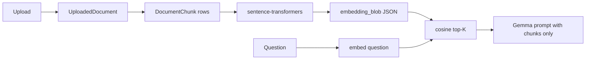

# Phase 0: Foundation

This guide walks through Phase 0 of the [userflow implementation plan](../../userflow.md). It turns the current single-page flashcard app into an extensible foundation with a database, shared layout, and refactored Gemma service — **without breaking existing SSE flashcard generation**.

Phase 0 also **prepares the database schema** for Phase 2b PyTorch embeddings (document chunks + vocab vectors), but does **not** install PyTorch yet.

## Goals

| In scope (Phase 0) | Out of scope (Phase 1+) |
|--------------------|-------------------------|
| SQLite + SQLAlchemy models | Onboarding form logic |
| `DocumentChunk` table + `embedding_blob` columns (empty until Phase 2b) | PyTorch / sentence-transformers |
| Flask app factory pattern | Save deck to database |
| Extract Gemma code to `services/gemma.py` | PDF upload, quiz, dictionary |
| Shared `base.html` navigation | Dashboard stats |
| Move flashcards UI to `flashcards.html` | History-aware word exclusion |
| Stub routes so nav links work | Semantic search RAG pipeline |

## AI stack across phases

| Phase | AI role | PyTorch? |
|-------|---------|----------|
| **0** | Schema hooks for future embeddings | No |
| **1** | Gemma API for flashcards, upload vocab, quiz | No |
| **2a** | Gemma + topic tags + truncated doc Q&A | No |
| **2b** | Embeddings for semantic search + similar words | **Yes** (`sentence-transformers`) |
| **3** | Optional forget-predictor on quiz history | Optional |

**Upload → Gemma vocab scan does not need PyTorch.** PyTorch enters in Phase 2b when you need to find the *right chunks* of a long document by meaning, or find *related words* by vector similarity.

## Exit criteria

Before moving to Phase 1, verify:

- [ ] `uv sync` succeeds with new dependencies
- [ ] App starts: `uv run flask --app app run --debug`
- [ ] `instance/learning.db` is created with all tables (including `document_chunk`)
- [ ] `VocabularyItem.embedding_blob` and `DocumentChunk.embedding_blob` columns exist (nullable, unused until Phase 2b)
- [ ] Navigation bar appears on every page
- [ ] `/flashcards` still generates and streams cards via SSE
- [ ] Stub pages (Dashboard, Upload, etc.) render without errors

---

## Prerequisites

- Python 3.14+ (see `.python-version`)
- [uv](https://github.com/astral-sh/uv) installed
- `GEMINI_API_KEY` in `gemma-flashcards/.env`
- Flask app currently working from `gemma-flashcards/`

---

## Folder structure after Phase 0

```
gemma-flashcards/
├── app.py
├── extensions.py
├── models/
│   └── __init__.py
├── routes/
│   ├── __init__.py
│   ├── main.py           # stub pages for nav
│   └── flashcards.py     # /flashcards + /stream
├── services/
│   ├── __init__.py
│   ├── gemma.py          # prompts, SSE helpers, streaming
│   └── profile.py        # get_profile helper
│   # Phase 2b (add later, not in Phase 0):
│   # ├── embeddings.py   # sentence-transformers, cosine similarity
│   # └── retrieval.py    # chunk documents, semantic search
├── templates/
│   ├── base.html
│   ├── flashcards.html   # moved from index.html
│   └── stub.html         # placeholder for Phase 1 pages
├── static/
│   └── css/
│       └── main.css      # extracted from inline styles
├── uploads/              # empty, gitignored
└── instance/
    └── learning.db       # auto-created, gitignored
```

---

## Step 0.1 — Add dependencies

Edit `pyproject.toml`:

```toml
[project]
name = "gemma-flashcards"
version = "0.1.0"
description = "Gemma-powered language learning memory system"
readme = "README.md"
requires-python = ">=3.14"
dependencies = [
    "flask>=3.1.3",
    "flask-sqlalchemy>=3.1.0",
    "google-genai>=2.10.0",
    "ollama>=0.6.2",
    "pydantic>=2.13.4",
    "python-dotenv>=1.2.2",
]
```

Run from `gemma-flashcards/`:

```bash
uv sync
```

> **Note:** `pypdf` is added in Phase 1 for PDF upload. **Do not add `sentence-transformers` or PyTorch in Phase 0** — that is Phase 2b (~500MB download). Phase 0 only creates nullable `embedding_blob` columns so Phase 2b can fill them later without a schema migration.

---

## Step 0.2 — Update `.gitignore`

Add to the repo root `.gitignore` (or `gemma-flashcards/.gitignore`):

```gitignore
instance/
uploads/
*.db
```

---

## Step 0.3 — Create `extensions.py`

SQLAlchemy lives in its own module so `models/` and `routes/` can import `db` without circular imports with `app.py`.

```python
# extensions.py
from flask_sqlalchemy import SQLAlchemy

db = SQLAlchemy()
```

---

## Step 0.4 — Define SQLAlchemy models

Create `models/__init__.py` with all tables. Phase 0 creates the full schema upfront so Phase 1 only adds routes and logic — no schema migrations needed for the MVP.

**Important for Phase 2b:** Include `DocumentChunk` and `embedding_blob` columns now. They stay `NULL` until Phase 2b runs `sentence-transformers`.

```python
# models/__init__.py
from datetime import datetime

from extensions import db


class UserProfile(db.Model):
    __tablename__ = "user_profile"

    id = db.Column(db.Integer, primary_key=True)
    target_language = db.Column(db.String(32), nullable=False, default="French")
    native_language = db.Column(db.String(32), nullable=False, default="English")
    level = db.Column(db.String(8))       # A1, A2, B1, B2, C1, or null
    goal = db.Column(db.String(64))       # daily_conversation, exam_prep, etc.
    streak_days = db.Column(db.Integer, default=0)
    last_active_date = db.Column(db.Date)
    created_at = db.Column(db.DateTime, default=datetime.utcnow)


class UploadedDocument(db.Model):
    __tablename__ = "uploaded_document"

    id = db.Column(db.Integer, primary_key=True)
    filename = db.Column(db.String(256))
    raw_text = db.Column(db.Text, nullable=False)
    language = db.Column(db.String(32))
    detected_topics = db.Column(db.JSON, default=list)
    word_count = db.Column(db.Integer, default=0)
    uploaded_at = db.Column(db.DateTime, default=datetime.utcnow)

    vocabulary_items = db.relationship("VocabularyItem", backref="document", lazy=True)
    chunks = db.relationship("DocumentChunk", backref="document", lazy=True, cascade="all, delete-orphan")


class DocumentChunk(db.Model):
    """Text chunks from uploaded documents. Embeddings filled in Phase 2b."""
    __tablename__ = "document_chunk"

    id = db.Column(db.Integer, primary_key=True)
    document_id = db.Column(db.Integer, db.ForeignKey("uploaded_document.id"), nullable=False)
    chunk_index = db.Column(db.Integer, nullable=False)
    text = db.Column(db.Text, nullable=False)
    embedding_blob = db.Column(db.JSON)  # list[float]; NULL until Phase 2b indexes document
    created_at = db.Column(db.DateTime, default=datetime.utcnow)


class FlashcardDeck(db.Model):
    __tablename__ = "flashcard_deck"

    id = db.Column(db.Integer, primary_key=True)
    title = db.Column(db.String(256), nullable=False)
    language = db.Column(db.String(32), nullable=False)
    source_type = db.Column(db.String(32))   # topic, document, dictionary, excel
    source_id = db.Column(db.Integer)
    created_at = db.Column(db.DateTime, default=datetime.utcnow)

    cards = db.relationship(
        "Flashcard", backref="deck", lazy=True, cascade="all, delete-orphan"
    )


class VocabularyItem(db.Model):
    __tablename__ = "vocabulary_item"

    id = db.Column(db.Integer, primary_key=True)
    word = db.Column(db.String(128), nullable=False)
    language = db.Column(db.String(32), nullable=False)
    meaning = db.Column(db.Text)
    example = db.Column(db.Text)
    topic = db.Column(db.String(64))
    difficulty = db.Column(db.String(16))
    source_type = db.Column(db.String(32))
    source_id = db.Column(db.Integer)
    document_id = db.Column(db.Integer, db.ForeignKey("uploaded_document.id"))
    mastery_status = db.Column(db.String(16), default="new")
    first_seen_at = db.Column(db.DateTime, default=datetime.utcnow)
    last_reviewed_at = db.Column(db.DateTime)
    review_count = db.Column(db.Integer, default=0)
    quiz_accuracy = db.Column(db.Float, default=0.0)
    user_notes = db.Column(db.Text)
    embedding_blob = db.Column(db.JSON)  # list[float]; NULL until Phase 2b embeds word+meaning

    __table_args__ = (
        db.UniqueConstraint("word", "language", name="uq_word_language"),
    )


class Flashcard(db.Model):
    __tablename__ = "flashcard"

    id = db.Column(db.Integer, primary_key=True)
    deck_id = db.Column(db.Integer, db.ForeignKey("flashcard_deck.id"), nullable=False)
    vocabulary_item_id = db.Column(db.Integer, db.ForeignKey("vocabulary_item.id"))
    front = db.Column(db.String(256), nullable=False)
    back = db.Column(db.Text, nullable=False)
    example = db.Column(db.Text)
    topic = db.Column(db.String(64))
    difficulty = db.Column(db.String(16))
    memory_tip = db.Column(db.Text)


class DictionarySearch(db.Model):
    __tablename__ = "dictionary_search"

    id = db.Column(db.Integer, primary_key=True)
    word = db.Column(db.String(128), nullable=False)
    language = db.Column(db.String(32), nullable=False)
    result_json = db.Column(db.JSON)
    document_id = db.Column(db.Integer, db.ForeignKey("uploaded_document.id"))
    added_to_deck = db.Column(db.Boolean, default=False)
    searched_at = db.Column(db.DateTime, default=datetime.utcnow)


class QuizSession(db.Model):
    __tablename__ = "quiz_session"

    id = db.Column(db.Integer, primary_key=True)
    source_type = db.Column(db.String(32))
    source_id = db.Column(db.Integer)
    quiz_type = db.Column(db.String(32))
    score = db.Column(db.Integer, default=0)
    total = db.Column(db.Integer, default=0)
    started_at = db.Column(db.DateTime, default=datetime.utcnow)
    finished_at = db.Column(db.DateTime)

    answers = db.relationship(
        "QuizAnswer", backref="session", lazy=True, cascade="all, delete-orphan"
    )


class QuizAnswer(db.Model):
    __tablename__ = "quiz_answer"

    id = db.Column(db.Integer, primary_key=True)
    session_id = db.Column(db.Integer, db.ForeignKey("quiz_session.id"), nullable=False)
    vocabulary_item_id = db.Column(db.Integer, db.ForeignKey("vocabulary_item.id"))
    question = db.Column(db.Text)
    user_answer = db.Column(db.Text)
    correct_answer = db.Column(db.Text)
    is_correct = db.Column(db.Boolean, default=False)
    mistake_type = db.Column(db.String(32))


class ProgressSnapshot(db.Model):
    __tablename__ = "progress_snapshot"

    id = db.Column(db.Integer, primary_key=True)
    date = db.Column(db.Date, nullable=False, unique=True)
    words_learned = db.Column(db.Integer, default=0)
    words_mastered = db.Column(db.Integer, default=0)
    quiz_accuracy = db.Column(db.Float, default=0.0)
    time_spent_minutes = db.Column(db.Integer, default=0)
```

### Quick sanity check in Flask shell

After Step 0.6, verify the database:

```bash
uv run flask --app app shell
```

```python
>>> from models import UserProfile
>>> UserProfile.query.all()
[]
>>> exit()
```

---

## Step 0.5 — Create profile helper

```python
# services/__init__.py
# (empty file — marks services as a package)
```

```python
# services/profile.py
from extensions import db
from models import UserProfile


def get_profile():
    """Return the single local user profile, creating one if needed."""
    profile = UserProfile.query.first()
    if not profile:
        profile = UserProfile(target_language="French", native_language="English")
        db.session.add(profile)
        db.session.commit()
    return profile
```

---

## Step 0.6 — Extract Gemma service

Move all AI logic from the current `app.py` into `services/gemma.py`. This is mostly a copy-paste refactor with extended Pydantic schemas for Phase 1.

```python
# services/gemma.py
import json
import os

from google import genai
from google.genai import types
from ollama import Client as OllamaClient
from pydantic import BaseModel, Field

GOOGLE_MODEL = "gemma-4-26b-a4b-it"
LOCAL_MODEL = os.environ.get("LOCAL_MODEL", "gemma3:4b")


# --- Pydantic schemas (API response shape from Gemma) ---

class FlashcardSchema(BaseModel):
    front: str = Field(description="A short word or phrase in the target language.")
    back: str = Field(description="The meaning plus a tiny learning note.")
    example: str = Field(description="A short example sentence.")
    topic: str = Field(default="", description="Topic tag, e.g. sports, food.")
    difficulty: str = Field(default="beginner", description="beginner, intermediate, advanced.")
    memory_tip: str = Field(default="", description="Short mnemonic or learning tip.")


class DeckSchema(BaseModel):
    cards: list[FlashcardSchema] = Field(description="The full set of flashcards.")


# --- SSE helpers ---

def sse(event, data):
    return f"event: {event}\ndata: {json.dumps(data)}\n\n"


def clean_count(value):
    try:
        return min(max(int(value), 1), 20)
    except (TypeError, ValueError):
        return 6


# --- Prompts ---

def build_topic_prompt(language, theme, count, exclude_words=None, native_language="English"):
    exclude = ""
    if exclude_words:
        exclude = f"\nDo NOT include these already-known words: {', '.join(exclude_words)}"
    return f"""
Create a deck of exactly {count} flashcards for a beginner learning {language}.
Explain meanings in {native_language}.

Theme: {theme}
{exclude}

Each flashcard has:
- front: a short word or phrase in {language}
- back: the meaning plus a tiny, friendly learning note
- example: a short example sentence that fits the theme
- topic: a topic tag
- difficulty: beginner, intermediate, or advanced
- memory_tip: a short mnemonic (optional)

Rules:
- Do not repeat cards.
- Order the deck from easier to harder.
"""


# --- Streaming JSON parser (unchanged from original app.py) ---

def stream_cards(text_pieces):
    """Yield each flashcard the moment it is complete in the JSON stream."""
    buffer = ""
    scanned = 0
    depth = 0
    in_string = False
    escaped = False
    start = None

    for piece in text_pieces:
        buffer += piece
        while scanned < len(buffer):
            char = buffer[scanned]

            if in_string:
                if escaped:
                    escaped = False
                elif char == "\\":
                    escaped = True
                elif char == '"':
                    in_string = False
            elif char == '"':
                in_string = True
            elif char == "{":
                depth += 1
                if depth == 2:
                    start = scanned
            elif char == "}":
                if depth == 2 and start is not None:
                    try:
                        yield json.loads(buffer[start : scanned + 1])
                    except json.JSONDecodeError:
                        pass
                    start = None
                depth -= 1

            scanned += 1


# --- Provider calls ---

def google_cards(client, prompt):
    stream = client.models.generate_content_stream(
        model=GOOGLE_MODEL,
        contents=prompt,
        config=types.GenerateContentConfig(
            temperature=0.7,
            response_mime_type="application/json",
            response_schema=DeckSchema,
        ),
    )
    return (chunk.text for chunk in stream if chunk.text)


def local_cards(client, prompt):
    stream = client.chat(
        model=LOCAL_MODEL,
        messages=[
            {
                "role": "system",
                "content": "You create short, friendly language-learning flashcards.",
            },
            {"role": "user", "content": prompt},
        ],
        format=DeckSchema.model_json_schema(),
        options={"temperature": 0.7},
        stream=True,
    )
    return (chunk.message.content for chunk in stream if chunk.message.content)


def card_stream(language, theme, count, provider="google", exclude_words=None, native_language="English"):
    """Return an iterator of raw card dicts from the chosen provider."""
    prompt = build_topic_prompt(language, theme, count, exclude_words, native_language)

    if provider == "local":
        client = OllamaClient()
        pieces = local_cards(client, prompt)
    else:
        api_key = os.environ.get("GEMINI_API_KEY")
        if not api_key:
            raise RuntimeError("Missing GEMINI_API_KEY in your .env file.")
        client = genai.Client(api_key=api_key)
        pieces = google_cards(client, prompt)

    yield from stream_cards(pieces)
```

---

## Step 0.7 — Create route blueprints

### Flashcards blueprint (real functionality)

```python
# routes/__init__.py
# (empty file)
```

```python
# routes/flashcards.py
import os

from flask import Blueprint, Response, render_template, request, stream_with_context
from google import genai
from ollama import Client as OllamaClient
from ollama import ResponseError
from pydantic import ValidationError

from services.gemma import (
    FlashcardSchema,
    card_stream,
    clean_count,
    sse,
)

bp = Blueprint("flashcards", __name__)


@bp.get("/flashcards")
def index():
    return render_template("flashcards.html")


@bp.get("/stream")
def stream():
    language = request.args.get("language", "French").strip() or "French"
    theme = request.args.get("theme", "World Cup soccer").strip() or "World Cup soccer"
    provider = request.args.get("provider", "google")
    count = clean_count(request.args.get("count", "6"))

    @stream_with_context
    def events():
        try:
            emitted = 0
            for card_data in card_stream(language, theme, count, provider):
                try:
                    card = FlashcardSchema.model_validate(card_data)
                except ValidationError:
                    continue

                emitted += 1
                yield sse(
                    "card",
                    {"index": emitted, "total": count, "card": card.model_dump()},
                )
                yield sse("progress", {"current": emitted, "total": count})

                if emitted >= count:
                    break

            if emitted == 0:
                yield sse("error", {"message": "The model didn't return any cards. Try again."})
                return

        except ResponseError as exc:
            yield sse("error", {"message": f"Ollama error: {exc.error}"})
            return
        except RuntimeError as exc:
            yield sse("error", {"message": str(exc)})
            return
        except Exception as exc:
            yield sse("error", {"message": f"Something went wrong: {exc}"})
            return

        yield sse("done", {"message": "Deck ready"})

    return Response(
        events(),
        mimetype="text/event-stream",
        headers={"Cache-Control": "no-cache", "X-Accel-Buffering": "no"},
    )
```

### Main blueprint (stub pages for nav)

Phase 0 uses placeholder pages so navigation links do not 404. Phase 1 replaces these with real implementations.

```python
# routes/main.py
from flask import Blueprint, redirect, render_template, url_for

bp = Blueprint("main", __name__)

STUB_PAGES = {
    "dashboard": "Dashboard",
    "upload": "Upload",
    "quiz": "Quiz",
    "dictionary": "Dictionary",
    "history": "History",
    "settings": "Settings",
}


@bp.get("/")
def home():
    return redirect(url_for("flashcards.index"))


@bp.get("/dashboard")
def dashboard():
    return render_template("stub.html", page_title="Dashboard", phase="Phase 1")


@bp.get("/upload")
def upload():
    return render_template("stub.html", page_title="Upload", phase="Phase 1")


@bp.get("/quiz")
def quiz():
    return render_template("stub.html", page_title="Quiz", phase="Phase 1")


@bp.get("/dictionary")
def dictionary():
    return render_template("stub.html", page_title="Dictionary", phase="Phase 1")


@bp.get("/history")
def history():
    return render_template("stub.html", page_title="History", phase="Phase 1")


@bp.get("/settings")
def settings():
    return render_template("stub.html", page_title="Settings", phase="Phase 1")
```

---

## Step 0.8 — Rewrite `app.py` as app factory

Replace the current monolithic `app.py` with:

```python
# app.py
import os

from dotenv import load_dotenv
from flask import Flask

from extensions import db

load_dotenv()


def create_app():
    app = Flask(__name__)
    app.config["SECRET_KEY"] = os.environ.get("SECRET_KEY", "dev-secret")
    app.config["SQLALCHEMY_DATABASE_URI"] = "sqlite:///learning.db"
    app.config["SQLALCHEMY_TRACK_MODIFICATIONS"] = False
    app.config["UPLOAD_FOLDER"] = os.path.join(app.root_path, "uploads")

    os.makedirs(app.config["UPLOAD_FOLDER"], exist_ok=True)

    db.init_app(app)

    with app.app_context():
        import models  # noqa: F401 — register all models with SQLAlchemy
        db.create_all()

    from routes import flashcards, main

    app.register_blueprint(main.bp)
    app.register_blueprint(flashcards.bp)

    return app


app = create_app()

if __name__ == "__main__":
    app.run(debug=True)
```

---

## Step 0.9 — Create templates

### `templates/base.html`

```html
<!doctype html>
<html lang="en">
  <head>
    <meta charset="utf-8" />
    <meta name="viewport" content="width=device-width, initial-scale=1" />
    <title>Gemma Learning</title>
    <link rel="stylesheet" href="{{ url_for('static', filename='css/main.css') }}" />
    
  </head>
  <body>
    <header class="site-header">
      <div class="brand">
        <div class="mark">G</div>
        <div>
          <strong>Gemma Learning</strong>
          <span class="muted">Language memory system</span>
        </div>
      </div>
      <nav class="nav">
        <a href="{{ url_for('main.dashboard') }}">Dashboard</a>
        <a href="{{ url_for('main.upload') }}">Upload</a>
        <a href="{{ url_for('flashcards.index') }}">Flashcards</a>
        <a href="{{ url_for('main.quiz') }}">Quiz</a>
        <a href="{{ url_for('main.dictionary') }}">Dictionary</a>
        <a href="{{ url_for('main.history') }}">History</a>
        <a href="{{ url_for('main.settings') }}">Settings</a>
      </nav>
    </header>
    <main class="container">
      
    </main>
  </body>
</html>
```

### `templates/stub.html`

```html

{{ page_title }} — Gemma Learning

<section class="stub">
  <h1>{{ page_title }}</h1>
  <p class="muted">This page will be implemented in {{ phase }}.</p>
  <a href="{{ url_for('flashcards.index') }}">Go to Flashcards</a>
</section>

```

### `templates/flashcards.html`

1. Copy the entire contents of the current `templates/index.html`.
2. Add at the very top:

```html

Flashcards — Gemma Learning

<style>
  /* Keep the existing inline <style> block here for now.
     Phase 1 can move it to static/css/main.css */
</style>


```

3. Add before the final closing tag:

```html

```

4. Remove the outer `<html>`, `<head>`, and `<body>` tags — `base.html` provides those.
5. Keep the SSE JavaScript **unchanged**. It still calls `/stream`.

---

## Step 0.10 — Extract shared CSS (optional but recommended)

Create `static/css/main.css` with nav and layout styles. Move the `:root` variables and `body` styles from `index.html`. Add nav styles:

```css
/* static/css/main.css */
:root {
  --green: #58cc02;
  --green-dark: #46a302;
  --ink: #17210f;
  --muted: #66735f;
  --line: #dfe8d8;
  --soft: #f6fbf2;
  --white: #ffffff;
}

* {
  box-sizing: border-box;
}

body {
  margin: 0;
  min-height: 100vh;
  background: var(--soft);
  color: var(--ink);
  font-family: Inter, ui-sans-serif, system-ui, sans-serif;
}

.site-header {
  display: flex;
  align-items: center;
  justify-content: space-between;
  gap: 24px;
  padding: 16px 24px;
  background: var(--white);
  border-bottom: 1px solid var(--line);
}

.brand {
  display: flex;
  align-items: center;
  gap: 12px;
}

.mark {
  display: grid;
  width: 36px;
  height: 36px;
  place-items: center;
  border-radius: 8px;
  background: var(--green);
  color: var(--white);
  font-weight: 900;
}

.nav {
  display: flex;
  flex-wrap: wrap;
  gap: 12px;
}

.nav a {
  color: var(--ink);
  text-decoration: none;
  font-size: 14px;
  font-weight: 600;
}

.nav a:hover {
  color: var(--green-dark);
}

.container {
  padding: 24px;
}

.muted {
  color: var(--muted);
  font-size: 14px;
}

.stub {
  max-width: 480px;
  padding: 32px;
  background: var(--white);
  border: 1px solid var(--line);
  border-radius: 8px;
}
```

Keep flashcard-specific styles in `flashcards.html` for Phase 0, or move them to `main.css` if you prefer one file.

---

## Step 0.11 — Run and verify

```bash
cd gemma-flashcards
uv sync
uv run flask --app app run --debug
```

### Manual test checklist

| Test | Expected result |
|------|-----------------|
| Open `http://127.0.0.1:5000/` | Redirects to `/flashcards` |
| Click each nav link | Stub page or flashcards loads, no 404 |
| Generate cards on `/flashcards` | Cards stream in one by one via SSE |
| Flip a card | Front/back animation works |
| Check `instance/learning.db` exists | File present after first run |
| Restart server | App still starts, DB persists |

### Verify database tables

```bash
uv run python -c "
from app import app, db
with app.app_context():
    print(db.engine.table_names())
"
```

Expected tables: `user_profile`, `vocabulary_item`, `flashcard_deck`, `flashcard`, `uploaded_document`, `document_chunk`, `dictionary_search`, `quiz_session`, `quiz_answer`, `progress_snapshot`.

Verify embedding columns exist (values will be `NULL` in Phase 0):

```python
>>> from models import VocabularyItem, DocumentChunk
>>> VocabularyItem.__table__.c.embedding_blob.nullable
True
>>> DocumentChunk.__table__.c.embedding_blob.nullable
True
```

---

## Step 0.12 — Prepare for Phase 2b embeddings (schema only)

Phase 0 does **not** install PyTorch. It only ensures the database and service layout can support embeddings later.

### What Phase 2b will add (for reference)

```toml
# pyproject.toml — add in Phase 2b, NOT Phase 0
"sentence-transformers>=3.0.0",
"numpy>=2.0.0",
```

```python
# services/embeddings.py — Phase 2b
from sentence_transformers import SentenceTransformer

_model = None

def get_model():
    global _model
    if _model is None:
        _model = SentenceTransformer("all-MiniLM-L6-v2")
    return _model

def embed_text(text: str) -> list[float]:
    return get_model().encode(text, normalize_embeddings=True).tolist()
```

### How Phase 2b uses Phase 0 schema

| Feature | Phase 0 prepares | Phase 2b activates |
|---------|------------------|---------------------|
| Semantic study search | `DocumentChunk` table | Chunk upload → embed → store in `embedding_blob` → cosine search → Gemma RAG |
| Similar words | `VocabularyItem.embedding_blob` | Embed word+meaning on save → find neighbors |
| Topic continuity | Same vocab embeddings | Find related old words when studying new topic (e.g. sports → soccer) |
| Ask Gemma on long docs | `UploadedDocument.raw_text` | Replace truncation with top-K retrieved chunks |

### RAG flow (Phase 2b — not built in Phase 0)



Phase 0 exit: tables exist, columns nullable, no PyTorch import anywhere in the codebase.

---

## Troubleshooting

### `CircularImportError` involving `db`

**Cause:** `app.py` imports models, models import `app`.

**Fix:** Always import `db` from `extensions.py`, never from `app.py`.

### Nav links show `BuildError: Could not build url for endpoint`

**Cause:** Blueprint not registered or endpoint name mismatch.

**Fix:** Ensure `@bp.get("/flashcards")` function is named `index` inside the `flashcards` blueprint, referenced as `url_for("flashcards.index")`.

### SSE stream stops immediately

**Cause:** Missing `GEMINI_API_KEY` or model error.

**Fix:** Check `.env` and the Flask terminal for error messages. The `/stream` route sends errors as SSE `error` events.

### `LOCAL_MODEL` NameError (old app.py bug)

The original `app.py` references `LOCAL_MODEL` in the Ollama error handler but never defines it. The new `services/gemma.py` defines:

```python
LOCAL_MODEL = os.environ.get("LOCAL_MODEL", "gemma3:4b")
```

### Flashcards page has broken layout after extending `base.html`

**Cause:** Duplicate `<main>` or missing `` wrapper.

**Fix:** Only the inner app grid goes inside ``. Remove duplicate page-level wrappers.

---

## What comes next

| Phase | Focus | PyTorch? |
|-------|-------|----------|
| **Phase 1** | Onboarding, save deck, upload (Gemma scans text), dictionary, quiz, dashboard | No |
| **Phase 2a** | Weak review, Excel, Ask Gemma (truncated doc), topic tags | No |
| **Phase 2b** | Semantic search RAG, similar words, embedding-based topic continuity | **Yes** |
| **Phase 3** | Roadmap, conversation, charts, optional forget-predictor | Optional |

After Phase 0, implement Phase 1 in this order:

1. **Onboarding** — replace Settings stub with real profile form
2. **Save deck** — POST `/api/decks`, wire Save button in flashcards JS
3. **Dashboard** — replace stub with real stats from `VocabularyItem` and `QuizSession`
4. **Upload** — PDF/text upload with `pypdf`; Gemma extracts vocab (no PyTorch)
5. **Dictionary, Quiz, History** — replace remaining stubs

See [docs/README.md](README.md) for all phase guides. Next step: [Phase 1: MVP](phase-1-mvp.md).

---

## File creation checklist

Use this as a tick list while working:

- [ ] `extensions.py`
- [ ] `models/__init__.py` (includes `DocumentChunk` + `embedding_blob` columns)
- [ ] `services/__init__.py`
- [ ] `services/gemma.py`
- [ ] `services/profile.py`
- [ ] `routes/__init__.py`
- [ ] `routes/main.py`
- [ ] `routes/flashcards.py`
- [ ] `app.py` (rewritten)
- [ ] `templates/base.html`
- [ ] `templates/stub.html`
- [ ] `templates/flashcards.html` (from `index.html`)
- [ ] `static/css/main.css`
- [ ] `uploads/` directory
- [ ] `.gitignore` updated
- [ ] `pyproject.toml` updated
- [ ] `uv sync` run

You can delete or keep `templates/index.html` after confirming `/flashcards` works. Keeping it temporarily as a reference is fine.
