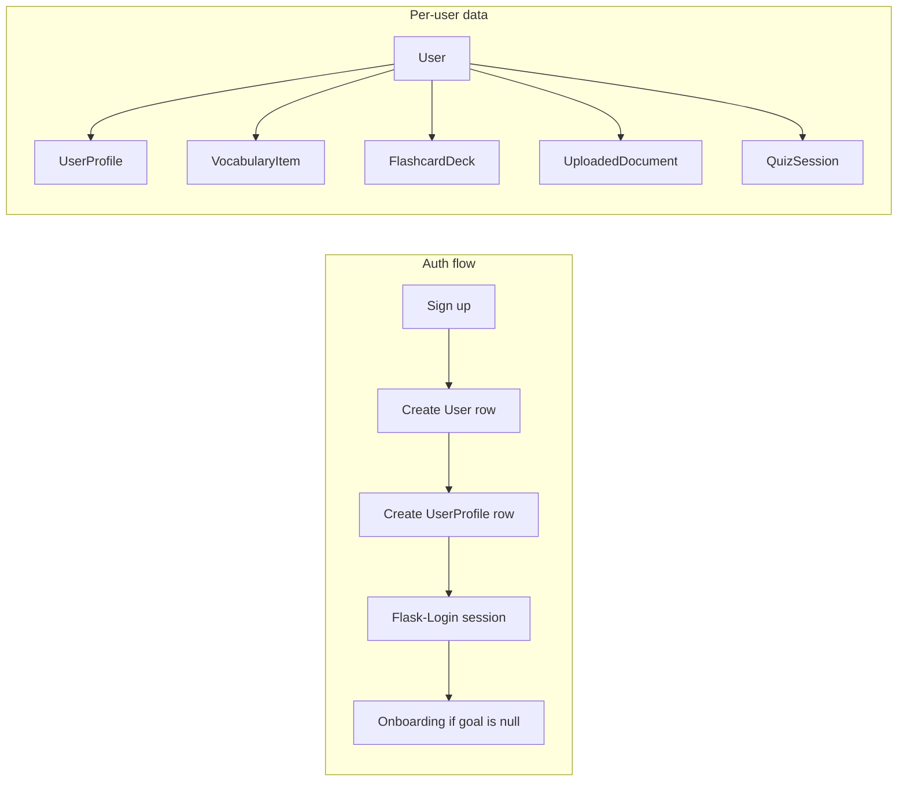

# Phase 4: User Accounts (Sign Up & Log In)

Builds on [Phase 1](phase-1-mvp.md) (minimum) and ideally [Phase 3](phase-3-advanced.md). Turns the app from a **single local learner** into a **multi-user** system where each person has their own vocabulary, decks, progress, and settings.

## Current baseline (today)

| Area | Current behavior | Problem for multi-user |
|------|------------------|------------------------|
| Identity | No login — anyone who opens the app shares one account | Data leaks across users |
| Profile | `UserProfile.query.first()` in `services/profile.py` | Only one profile row ever exists |
| Onboarding | Redirect if `profile.goal is None` | Runs before auth; no owner on profile |
| All learning data | `VocabularyItem`, `FlashcardDeck`, `UploadedDocument`, etc. have **no `user_id`** | Cannot isolate per learner |
| Sessions | Flask cookie session used only for Excel upload preview | No authenticated user id stored |
| Database | SQLite file `instance/learning.db` | Fine for dev; same file, many users |

Phase 3 docs list “Multi-user auth” as post-competition stretch. **Phase 4 is that stretch**, written as a concrete build guide.

---

## Goals

| In scope (Phase 4) | Out of scope (later) |
|--------------------|----------------------|
| Email + password sign up | OAuth (Google / GitHub) |
| Log in / log out | Email verification / password reset |
| Password hashing (never store plain text) | Admin panel |
| Per-user profile & onboarding | Paid plans / billing |
| Scope all queries to `current_user.id` | Postgres migration (optional note only) |
| Protect routes — redirect to login | Role-based permissions (teacher/student) |
| Nav shows account name + Log out | 2FA |

## Exit criteria

- [x] New user can **sign up** with email + password
- [x] Existing user can **log in** and **log out**
- [x] Wrong password shows a clear error; duplicate email blocked on sign up
- [x] After login, user sees **only their** vocabulary, decks, uploads, quiz history
- [x] Onboarding runs **once per user** after first login
- [x] Unauthenticated visit to `/dashboard` redirects to `/login`
- [x] `/flashcards/stream` and API routes require login (or return 401)
- [x] Old single-user data can be migrated OR app starts fresh (document your choice)

**Migration choice:** Option A — on startup, if the multi-user schema is missing (`user` table or `user_id` columns), the app drops and recreates the SQLite database. Existing single-user demo data is not preserved.

---

## Recommended stack

For this Flask + SQLAlchemy app, use:

| Piece | Library | Why |
|-------|---------|-----|
| Session auth | **Flask-Login** | Standard, minimal, works with your existing Flask patterns |
| Password hash | **werkzeug.security** | Already bundled with Flask (`generate_password_hash`, `check_password_hash`) |
| Forms | Plain HTML forms (match existing app) | No new form library required |
| DB | Keep SQLite for local dev | Add `user_id` columns; Postgres later if you deploy |

Add to `pyproject.toml`:

```toml
"flask-login>=0.6.3",
```

Then:

```bash
cd gemma-flashcards
uv sync
```

---

## Architecture overview



**Rule:** Every table that stores learner-specific data gets `user_id = db.ForeignKey("user.id")`. Every query adds `.filter_by(user_id=current_user.id)` (or equivalent join).

---

## Step 4.1 — Add `User` model

Add to `models/__init__.py`:

```python
from flask_login import UserMixin
from werkzeug.security import check_password_hash, generate_password_hash


class User(UserMixin, db.Model):
    __tablename__ = "user"

    id = db.Column(db.Integer, primary_key=True)
    email = db.Column(db.String(255), unique=True, nullable=False, index=True)
    password_hash = db.Column(db.String(256), nullable=False)
    display_name = db.Column(db.String(64))
    created_at = db.Column(db.DateTime, default=datetime.utcnow)
    is_active = db.Column(db.Boolean, default=True)

    profile = db.relationship(
        "UserProfile",
        backref="user",
        uselist=False,
        cascade="all, delete-orphan",
    )

    def set_password(self, password: str) -> None:
        self.password_hash = generate_password_hash(password)

    def check_password(self, password: str) -> bool:
        return check_password_hash(self.password_hash, password)
```

**Password rules (keep simple for v1):**

- Minimum 8 characters
- Require email format (basic `@` check or regex)
- Never log or flash the raw password

---

## Step 4.2 — Link `UserProfile` to `User`

Change `UserProfile` from singleton to 1:1 with `User`:

```python
class UserProfile(db.Model):
    __tablename__ = "user_profile"

    id = db.Column(db.Integer, primary_key=True)
    user_id = db.Column(db.Integer, db.ForeignKey("user.id"), unique=True, nullable=False)
    target_language = db.Column(db.String(32), nullable=False, default="French")
    native_language = db.Column(db.String(32), nullable=False, default="English")
    level = db.Column(db.String(16))
    goal = db.Column(db.String(64))
    streak_days = db.Column(db.Integer, default=0)
    last_active_date = db.Column(db.Date)
    profile_created_at = db.Column(db.DateTime, default=datetime.utcnow)
```

Remove the old pattern of creating a profile with no user.

---

## Step 4.3 — Add `user_id` to all learner-owned tables

Add `user_id` (nullable at first for migration, then `nullable=False`) to:

| Model | Notes |
|-------|--------|
| `UploadedDocument` | Direct owner |
| `FlashcardDeck` | Direct owner |
| `VocabularyItem` | Change unique constraint to `(user_id, word, language)` |
| `DictionarySearch` | Direct owner |
| `QuizSession` | Direct owner |
| `ProgressSnapshot` | Change unique to `(user_id, date)` |
| `AskHistory` | Direct owner |
| `Roadmap` | If Phase 3 models exist |
| `PlacementSession` | If Phase 3 models exist |
| `ConversationSession` | If Phase 3 models exist |

Example for vocabulary:

```python
class VocabularyItem(db.Model):
    # ... existing columns ...
    user_id = db.Column(db.Integer, db.ForeignKey("user.id"), nullable=False, index=True)

    __table_args__ = (
        db.UniqueConstraint("user_id", "word", "language", name="uq_user_word_language"),
    )
```

**Child rows** (`Flashcard`, `QuizAnswer`, `DocumentChunk`) stay tied through their parent (`deck_id`, `session_id`, `document_id`) — you usually do **not** need `user_id` on every child if parents are always filtered by user.

---

## Step 4.4 — Wire Flask-Login in `app.py`

Create `extensions.py` additions (or `services/auth.py`):

```python
from flask_login import LoginManager

login_manager = LoginManager()
login_manager.login_view = "auth.login"
login_manager.login_message_category = "info"
```

In `app.py`:

```python
from extensions import db, login_manager
from models import User

def create_app():
    app = Flask(__name__)
    # ... existing config ...
    db.init_app(app)
    login_manager.init_app(app)

    @login_manager.user_loader
    def load_user(user_id):
        return db.session.get(User, int(user_id))

    # register blueprints
    from routes import auth
    app.register_blueprint(auth.bp)
    # ... main, flashcards, api ...
```

---

## Step 4.5 — Auth routes (`routes/auth.py`)

New blueprint:

| Route | Method | Behavior |
|-------|--------|----------|
| `/signup` | GET, POST | Create `User` + empty `UserProfile`, log in, redirect onboarding |
| `/login` | GET, POST | Validate email/password, `login_user()`, redirect `next` or dashboard |
| `/logout` | POST | `logout_user()`, redirect login |

**Sign up POST sketch:**

```python
@bp.route("/signup", methods=["GET", "POST"])
def signup():
    if current_user.is_authenticated:
        return redirect(url_for("main.dashboard"))

    if request.method == "POST":
        email = request.form.get("email", "").strip().lower()
        password = request.form.get("password", "")
        display_name = request.form.get("display_name", "").strip()

        if User.query.filter_by(email=email).first():
            flash("An account with that email already exists.", "error")
            return render_template("signup.html")

        user = User(email=email, display_name=display_name or email.split("@")[0])
        user.set_password(password)
        db.session.add(user)
        db.session.flush()  # user.id available

        profile = UserProfile(user_id=user.id)
        db.session.add(profile)
        db.session.commit()

        login_user(user)
        return redirect(url_for("main.onboarding"))

    return render_template("signup.html")
```

**Log in POST sketch:**

```python
@bp.route("/login", methods=["GET", "POST"])
def signup():
    if request.method == "POST":
        email = request.form.get("email", "").strip().lower()
        password = request.form.get("password", "")
        user = User.query.filter_by(email=email).first()

        if user is None or not user.check_password(password):
            flash("Invalid email or password.", "error")
            return render_template("login.html")

        login_user(user, remember=bool(request.form.get("remember")))
        next_url = request.args.get("next")
        return redirect(next_url or url_for("main.dashboard"))

    return render_template("login.html")
```

Use **POST for logout** (form button in nav) to avoid CSRF via GET links.

---

## Step 4.6 — Templates

Create `templates/login.html` and `templates/signup.html` extending `base.html`.

**Sign up fields:**

- Display name (optional)
- Email
- Password
- Confirm password (client + server check)

**Login fields:**

- Email
- Password
- “Remember me” checkbox (optional)

Update `templates/base.html` header:

```html

  <span class="muted">{{ current_user.display_name or current_user.email }}</span>
  <form method="post" action="{{ url_for('auth.logout') }}" class="inline-form">
    <button type="submit" class="link-button">Log out</button>
  </form>

  <a href="{{ url_for('auth.login') }}">Log in</a>
  <a href="{{ url_for('auth.signup') }}">Sign up</a>

```

For auth pages, consider a **minimal layout** (hide main nav links) so logged-out users are not sent to protected pages.

---

## Step 4.7 — Replace `get_profile()` singleton logic

Update `services/profile.py`:

```python
from flask_login import current_user

def get_profile():
    if not current_user.is_authenticated:
        return None
    profile = current_user.profile
    if profile is None:
        profile = UserProfile(user_id=current_user.id)
        db.session.add(profile)
        db.session.commit()
    return profile
```

Update `routes/main.py`:

```python
from flask_login import login_required

@bp.before_app_request
def load_profile():
    if current_user.is_authenticated:
        g.profile = get_profile()
    else:
        g.profile = None

@bp.before_app_request
def require_onboarding():
    if not current_user.is_authenticated:
        return
    # ... skip static, auth routes, api ...
    profile = get_profile()
    if profile and profile.goal is None and request.endpoint != "main.onboarding":
        return redirect(url_for("main.onboarding"))
```

Add `@login_required` to every view that needs auth:

```python
@bp.route("/dashboard")
@login_required
def dashboard():
    ...
```

**Public routes (no login):** `/login`, `/signup`, static files.

**Everything else:** login required.

For SSE (`/flashcards/stream`), Flask-Login still works if the browser sends the session cookie on the EventSource request (same origin). Test this early.

---

## Step 4.8 — Scope every data query by user

This is the largest part of Phase 4. Search the codebase for `.query` and add user filters.

**Before:**

```python
VocabularyItem.query.order_by(VocabularyItem.first_seen_at.desc())
```

**After:**

```python
VocabularyItem.query.filter_by(user_id=current_user.id).order_by(...)
```

Files to audit (non-exhaustive):

| File | What to scope |
|------|----------------|
| `services/vocabulary.py` | Deck save, word upsert |
| `services/documents.py` | Upload save/delete |
| `services/review.py` | Review queue |
| `services/quiz.py` | Quiz sessions |
| `services/progress.py` | Dashboard stats, snapshots |
| `services/roadmap.py` | Roadmap fetch/generate |
| `routes/main.py` | Library, ask, upload lists |
| `routes/flashcards.py` | Deck list if any |
| `routes/api.py` | All JSON endpoints |

**When creating rows**, always set `user_id=current_user.id`.

**Helper (optional, reduces mistakes):**

```python
def owned_query(model):
    return model.query.filter_by(user_id=current_user.id)
```

---

## Step 4.9 — Database migration strategy

`db.create_all()` **does not alter** existing SQLite tables. Pick one path:

### Option A — Fresh start (easiest for local dev)

1. Stop Flask.
2. Delete `instance/learning.db`.
3. Start app — tables recreated with new schema.
4. Sign up as a new user.

### Option B — Keep existing demo data (one-time script)

1. Add nullable `user_id` columns.
2. Create a `User` row (e.g. `demo@local.dev`).
3. Run a script that sets `user_id` on all existing rows to that user.
4. Alter columns to `nullable=False` (or recreate tables).

Example backfill sketch:

```python
# scripts/backfill_user_id.py — run once inside flask shell
from extensions import db
from models import User, UserProfile, VocabularyItem, FlashcardDeck, UploadedDocument

user = User(email="demo@local.dev", display_name="Demo")
user.set_password("changeme123")
db.session.add(user)
db.session.flush()

if not user.profile:
    db.session.add(UserProfile(user_id=user.id, target_language="French", native_language="English", goal="daily_conversation"))

for model in (VocabularyItem, FlashcardDeck, UploadedDocument):
    model.query.filter_by(user_id=None).update({"user_id": user.id})

db.session.commit()
```

For a competition demo, **Option A** is usually fine.

---

## Step 4.10 — Security checklist

- [ ] `SECRET_KEY` set in `.env` (not `"dev-secret"` in production)
- [ ] Passwords stored as hashes only
- [ ] Login form uses POST; logout uses POST
- [ ] Validate `next` redirect — only allow relative paths (`/dashboard`, not `https://evil.com`)
- [ ] Rate-limit login attempts (stretch: Flask-Limiter)
- [ ] Do not expose whether email exists on login (use generic “Invalid email or password”)
- [ ] On sign up, confirm password matches server-side

**Safe redirect helper:**

```python
from urllib.parse import urlparse, urljoin

def is_safe_url(target):
    ref_url = urlparse(request.host_url)
    test_url = urlparse(urljoin(request.host_url, target))
    return test_url.scheme in ("http", "https") and ref_url.netloc == test_url.netloc
```

---

## Step 4.11 — Update onboarding flow

New user journey:

1. **Sign up** → auto login
2. **Onboarding** (`/onboarding`) — language, level, goal
3. **Dashboard**

Returning user:

1. **Log in**
2. If `goal` set → **Dashboard**
3. If `goal` missing → **Onboarding**

Remove auto-create profile on first app visit (that was the old single-user behavior).

---

## Step 4.12 — API & SSE auth

For `routes/api.py` and `routes/flashcards.py`:

```python
from flask_login import login_required, current_user

@bp.route("/api/progress/charts")
@login_required
def progress_charts():
    ...
```

If a fetch returns 401, front-end should redirect to login:

```javascript
if (response.status === 401) {
  window.location.href = "/login?next=" + encodeURIComponent(window.location.pathname);
}
```

---

## Suggested build order

1. **User model + Flask-Login** — login/signup/logout pages work
2. **UserProfile.user_id** — update `get_profile()`
3. **Route guards** — `@login_required` on main pages
4. **Add user_id to models** — recreate DB or migrate
5. **Scope queries** — vocabulary, decks, uploads first (highest traffic)
6. **Scope quiz, progress, ask, roadmap**
7. **Nav + flash messages** — polish
8. **Manual test with two accounts** — verify isolation

---

## Verification checklist

| Test | Expected |
|------|----------|
| Sign up as `alice@test.com` | Redirect to onboarding → dashboard |
| Log out | Session cleared; `/dashboard` → login |
| Log in as Alice | See Alice’s data only |
| Sign up as `bob@test.com` | Empty library, no Alice decks |
| Alice saves deck | Bob does not see it in library/quiz |
| Wrong password | Error message, no login |
| Duplicate email on signup | Error message |
| Visit `/login?next=/library` after login | Lands on library |
| SSE flashcards while logged in | Stream works |
| SSE flashcards while logged out | Redirect or 401 |

---

## Troubleshooting

**`current_user` is anonymous on every request:** Check `login_manager.init_app(app)`, `SECRET_KEY` stable across restarts, and cookies enabled.

**EventSource / SSE not authenticated:** EventSource sends cookies on same-origin requests by default. If it fails, confirm you are not on a different port/subdomain.

**Unique constraint errors on vocabulary:** Old constraint was `(word, language)`. Drop DB or migrate to `(user_id, word, language)`.

**Profile is None in templates:** Ensure `load_profile` runs only when authenticated; templates should use `g.profile` or `current_user.profile`.

**Existing data disappeared after migration:** Expected if you deleted `learning.db` — restore from backup or re-seed.

---

## What comes next (Phase 5+)

- Email verification + password reset (Flask-Mail or transactional email API)
- OAuth (“Continue with Google”)
- Deploy with Postgres + `gunicorn` (SQLite is not ideal for concurrent writes in production)
- Admin / teacher role: assign decks to students
- Export / delete my data (GDPR-style)

---

## File checklist

- [x] `pyproject.toml` — add `flask-login`
- [x] `models/__init__.py` — `User` model; `user_id` on owned tables
- [x] `extensions.py` — `LoginManager`
- [x] `app.py` — init login manager, register auth blueprint
- [x] `routes/auth.py` — signup, login, logout
- [x] `templates/login.html`, `templates/signup.html`
- [x] `templates/base.html` — auth links / user menu
- [x] `services/profile.py` — per-user `get_profile()`
- [x] All routes/services — `@login_required` + `user_id` filters
- [x] Migration script or documented fresh-DB steps
- [x] Update Phase 3 doc cross-reference: move “Multi-user auth” from post-competition to Phase 4

---

## Quick reference: before vs after

| Concern | Before (Phases 0–3) | After (Phase 4) |
|---------|---------------------|-----------------|
| Who am I? | Implicit single local user | `current_user` from Flask-Login |
| Profile | `UserProfile.query.first()` | `current_user.profile` |
| New visitor | Auto-created profile | Must sign up or log in |
| Vocabulary | Global | `filter_by(user_id=...)` |
| Competition story | “Local learning app” | “Personal accounts, private progress” |
